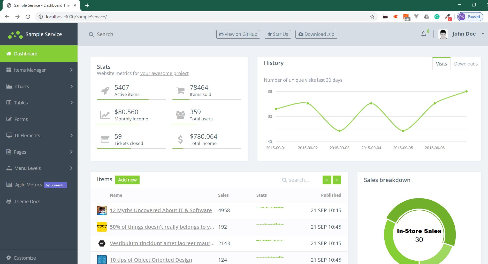

# windows-service-plus
Windows service plus - A boilerplate project for creating .NET windows service with additional features.

## Current Status 
Under development

## Features Planned
* Service Dashboard
* REST API
* Health Check API & Dashboard
* Jobs scheduler
* Log Viewer
* Email Triggers
* Batch files for install/start/stop

## Sneak Peek!

